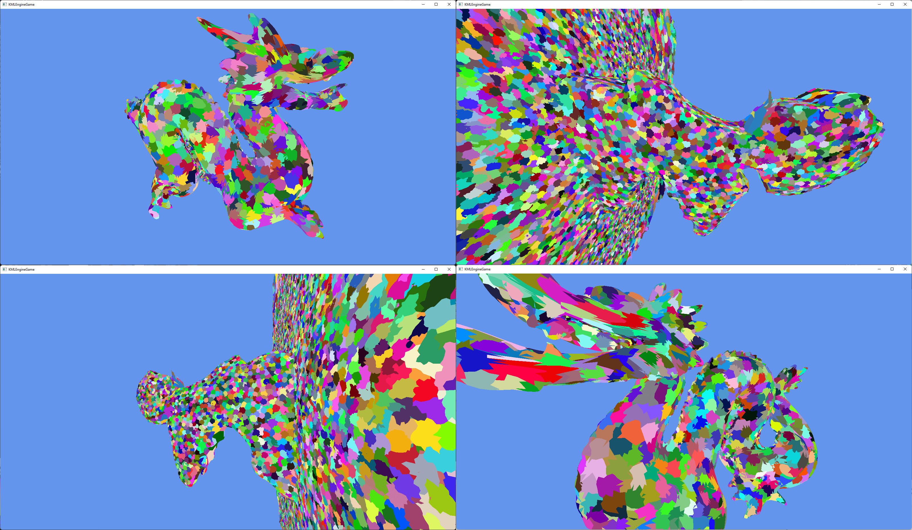

# kamel-old-cpp
🐉 The predecessor of Kamel, written by us in C++ around 2020 - 2021

Since it might be of interest to some of you, we decided to release the old code of our former engine. Of course, the code doesn't reflect our current potential, but it's still interesting to look at!

The engine is no longer being developed, but we are happy to answer any questions. The successor is available here:
* [kamel](https://github.com/projectkml/kamel)

